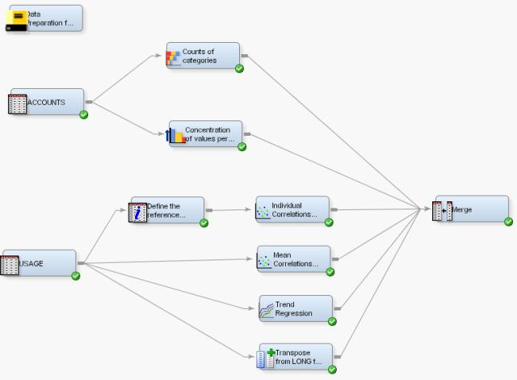

# Data-Preparation-Extension-Nodes-for-SAS-Enterprise-Miner

This page contains content of Extension Nodes for Data Preparation on Longitudinal Data for SAS Enterprise Miner 

## Overview
Extension nodes for are a powerful tool to enhance the functionality of SAS Enterprise Miner.
Basically you need only 3 things to create an extension node
* A SAS macro that defines the functionaliy
* A XML files that defines the node parameters and the code location
* An icon (16-Bit and 32-Bit) to display the icon in the toolbar and in the EM-Diagram.
At this page you will find two groups of extension nodes
* Extension Nodes for Data Preparation for Analytics which are based on the book with the same name
* Various extension nodes that I frequently use in SAS Enterprise Miner (GTOOLS)

## Extension Nodes for Data Preparation for Analytics

Based the book Data Preparation for Analytics five node are supplied that allow to pre-process transactional data.
Each node outputs the data in a one-row-per-subject data structure so that the data can be used for data mining
The following nodes are available
* Trend Regression: Calculates derived variables that describe the trend of an interval variable in up to two time intervals and creates a concatenated group variable
* Correlation: Calculates derived variables that describe the correlation of values with its overall mean per timeid or with other input variables
* Concentration: Calculates derived variables that describe the concentration of an interval variable in a sub-hierachy of the analysis subject
* Category Count: Calculates derived variables for categorical data. Aggregations like counts, distinct counts or proportions are calculated
* Transpose from LONG to WIDE: Transpose a dataset from a multiple-row-per-subject structure into a one-row-per-subject structure

## Various Extension Nodes - GTOOLS

These nodes are a collection of SAS Enterprise Miner Tools that I frequently use, as they seem helpful for me:
* Target BarChart: Displays the relationship between an input variable and the target variables in a bar chart
* Item-Relationship-Map: Displays the 2-way association rules in a hierarchical tree structure.
* Anonymous Node: Removes the id variable of a subject from the table and stores it in a separate table. Optionally creates a surrogate key. This node shall be used if a dataset shall be made anonymous.
* EM DataSource Copy: This node is not yet finished! It will copy to metadata of an existing data source in SAS Enterprise Miner.

## Download
Download the ZIP-file that contains the sources to install the extension nodes (XML-File, GIF-File, SAS Catalog). Additionally the ZIP file contains two example EM-Diagrams (These diagrams can be imported into SAS Enterprise Miner in order to see an example with the extension nodes.) and the SAS datasets USAGE and ACCOUNTS. Check the document Gerhards_Extension_Nodes_for_SAS_Enterprise_Miner_4_1.pdf for installation and usage.

## Install under EM
This text will be included into the document at a later point in time. It shall now quickly serve as hint, how to install unter EM.
Also refer to the online documenation or the [EM Extension Nodes Developers Guide](https://support.sas.com/documentation/cdl/en/emxndg/67980/PDF/default/emxndg.pdf)

I tested the nodes in EM and they work.
* Do you have a 32-bit or 64-bit machine? (the difference is with the sas-catalog that holds the macros, it differes between bit versions)? The download link on my website provides a 32 and 64 bit catalog, make sure that you use the right one.
* In EM 7.1 there is a new way to make the nodes available: I followed the way described in the EM 7.1 EM Extension Nodes Developers Guide (see also below for an excerpt) and created a directory: “c:\goto\sas\em_extensionnodes” (you can use any name) and consequently my entry in the management console looks like: dminemd.components.extra.dir. = c:\goto\sas\em_extensionnodes.
* In directory I have all my GIF (in subsdirectories) and XML files.
* The catalogs you can put directly into the SASHELP directory.
* Alternatively you can put it to any SAS library, but you need to use a command like this in your EM - autoexec.sas or EM Project startup code to point EM to the right library.
SAS Code

    libname extlib "C:\GOTO\SAS\EM_ExtensionNodes\SourceCode";
    catname sashelp.nodesbygerhard (extlib.nodesbygerhard);
    
## Server (EM Runs in Client Server Mode) Extensions (from the Developers Guide)
For a server configuration, specify the location of the extensions folder by adding a definition in the SAS Management Console. To add a definition, follow the steps below.
* Log on to the SAS Management Console as a SAS administrator.
* On the Plug-ins tab, select Application Management Configuration Manager SAS Application Infrastructure. 
* Right-click Enterprise Miner Mid-tier Services Properties.
* On the Advanced tab, locate the property named dminemd.components.extra.dir. In the Property Value field, enter the directory path to your extensions folder.
* Restart the SAS Enterprise Miner client to see the new node. There is no need to restart the middle-tier server.
For more information about the extension tools and the EXT Demo node, see the SAS Enterprise Miner Help documentation.

## for a Workstation (EM-Desktop)
For Workstation configurations, if the EMEXT folder is created under User Home on Windows 7 (for example C:\User\<userid>\EMEXT), it will be found automatically. For any other location, define a system environment variable named dminemid.components.extra.dir that contains the path for the directory that contains the extension xml file. It can be any directory accessible from the machine.
